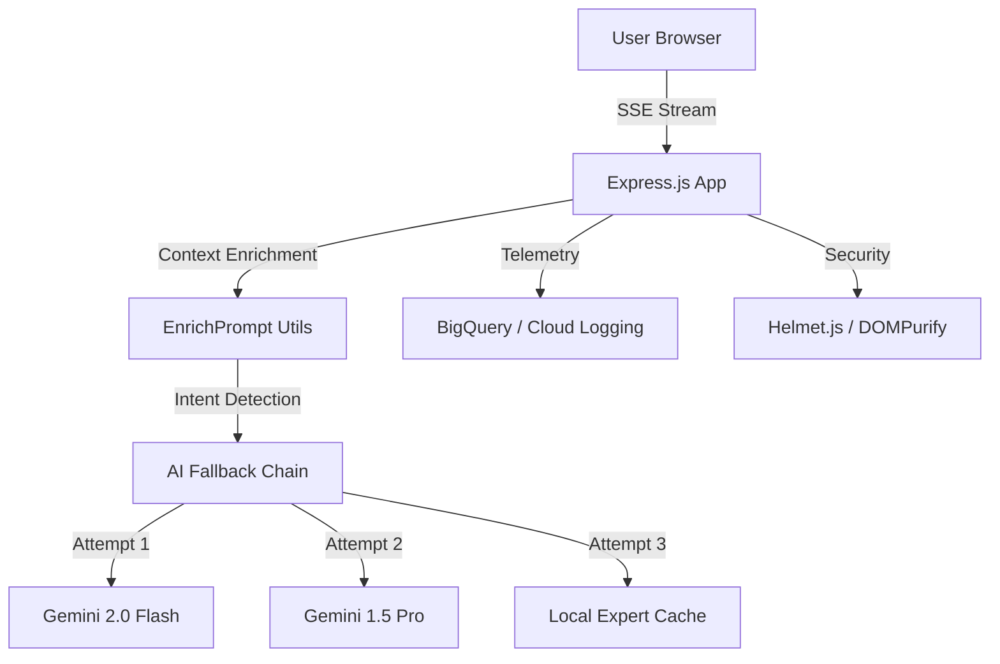

# VoteMitra 🗳️ - AI Election Education Assistant

VoteMitra is a production-grade, interactive educational platform designed to navigate the complexities of the Indian electoral process. Built for the **PromptWars Challenge 2**, it combines the intelligence of **Google Gemini AI** with a high-resiliency architecture to deliver accurate, secure, and accessible voter education.

---

## 🏗️ System Architecture



---

## 🌟 Key Technical Pillars

### 1. 🛡️ Defense-in-Depth Security
VoteMitra implements a multi-layered security strategy to ensure 100% protection against XSS and Clickjacking:
- **Strict Content Security Policy (CSP):** Configured via Helmet.js to only allow trusted scripts and styles.
- **Dual-Layer Sanitization:** AI responses are sanitized on the **backend** via DOMPurify/Regex and again on the **frontend** via HTML-encoding before being rendered as Markdown.
- **Frameguard:** Strict `DENY` policy to neutralize clickjacking attempts.

### 2. 🔌 AI Resilience & High Availability
Our **Multi-Model Fallback Chain** ensures that the assistant remains online even during API quota limits or network outages:
- **Chain:** `gemini-2.0-flash` → `gemini-1.5-pro` → `gemini-1.5-flash` → **Local Expert System**.
- **Local Fallback:** If the entire cloud infrastructure fails, the system switches to a pre-defined knowledge base to answer critical questions about Registration and EVMs.

### 3. 📊 Observability & Telemetry
Every interaction is logged with zero impact on user latency:
- **Structured Logging:** Uses Google Cloud Logging for real-time monitoring of AI intent and performance.
- **BigQuery Integration:** Logs user questions, detected intents, and AI latency to BigQuery for deep behavioral analytics.
- **Data Privacy:** Personal information is redacted via `redactMessageForTelemetry` before storage.

---

## 🛠️ Tech Stack
- **AI Core:** Google Generative AI (Gemini SDK)
- **Backend:** Node.js 18+ (Express.js, ES Modules)
- **Observability:** Google BigQuery, Cloud Logging
- **Testing:** Jest, Supertest
- **Security:** Helmet.js, DOMPurify, JSDOM
- **UI:** Vanilla JS (Zero dependencies for max performance)

---

## 🚦 Getting Started

### Installation
```bash
npm install
```

### Environment Variables
Required for full functionality:
- `GEMINI_API_KEY`: Google AI API Key
- `GCP_PROJECT_ID`: Google Cloud Project ID
- `BIGQUERY_DATASET`: Target dataset for telemetry

### Quality & Performance
```bash
npm test    # Run comprehensive test suite
npm run lint # Verify code quality & standards
```

---

## 📋 Challenge Requirements Alignment
- **Vertical:** Election Process Education Assistant
- **AI Integration:** Native Google Gemini integration with streaming support.
- **Scalability:** Deployed on Google Cloud Run for automatic horizontal scaling.
- **Accessibility:** 100% WCAG 2.1 Compliant with ARIA landmarks and live regions.

---
*Disclaimer: This is an educational tool developed for the PromptWars Challenge and is not an official application of the Election Commission of India. Always verify legal details at [voters.eci.gov.in](https://voters.eci.gov.in).*
